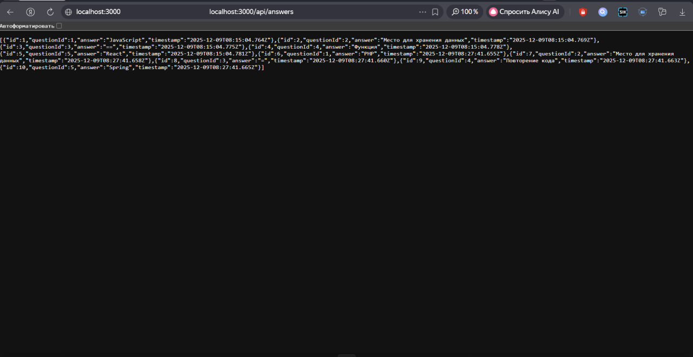
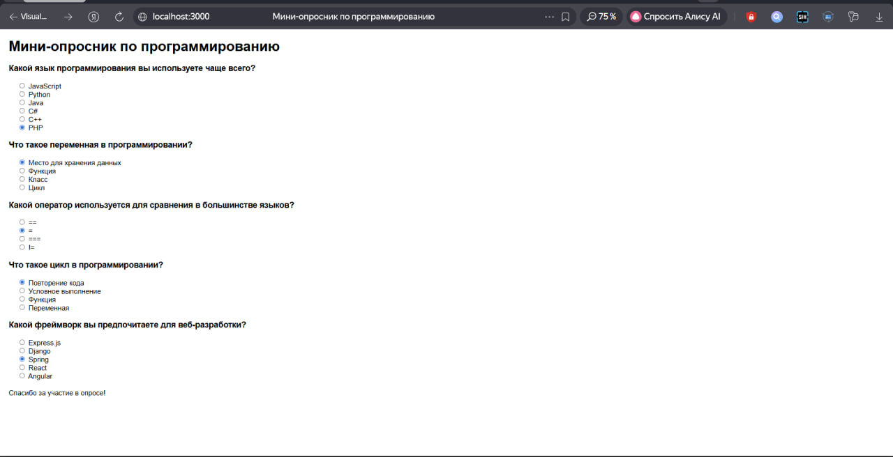

# Мини-опросник на Express.js

Это приложение представляет собой мини-опросник, разработанный с использованием Express.js для демонстрации основных принципов работы с фреймворком.

## Функциональность

- Получение списка вопросов
- Получение конкретного вопроса по ID
- Добавление новых вопросов
- Отправка ответов на вопросы
- Просмотр всех ответов (для администратора)

## Структура проекта

- `server.js` - основной файл сервера с настройками Express.js
- `routes/poll.js` - маршруты для API опросника
- `controllers/pollController.js` - контроллеры с логикой обработки запросов
- `middleware/logger.js` - собственный middleware для логирования запросов
- `public/index.html` - фронтенд для взаимодействия с опросником
- `public/` - директория для статических файлов

## Используемые технологии и принципы

- **Express.js сервер**: базовый сервер с middleware для обработки JSON и URL-encoded данных
- **Маршруты**: GET, POST, PUT, DELETE для управления вопросами и ответами
- **Параметры запроса**: req.params для ID, req.query для фильтрации
- **Middleware**: собственный логгер для отслеживания запросов
- **Статические файлы**: раздача HTML, CSS, JS через express.static()
- **Модульная архитектура**: разделение логики по routes и controllers

## Установка и запуск

1. Установите зависимости:
   ```
   npm install
   ```

2. Запустите сервер:
   ```
   npm start
   ```

   Или для разработки:
   ```
   npm run dev
   ```

Сервер будет запущен на порту 3000.

## API Endpoints

- `GET /api/questions` - получить все вопросы (опционально: ?limit=N для ограничения количества)
- `GET /api/questions/:id` - получить вопрос по ID
- `POST /api/questions` - добавить новый вопрос (тело: {question, options[]})
- `PUT /api/questions/:id` - обновить вопрос (тело: {question, options[]})
- `DELETE /api/questions/:id` - удалить вопрос
- `POST /api/answers` - отправить ответ (тело: {questionId, answer})
- `GET /api/answers` - получить все ответы (для администратора)

## Скриншоты




## Технологии

- Node.js
- Express.js
- JavaScript (ES6+)